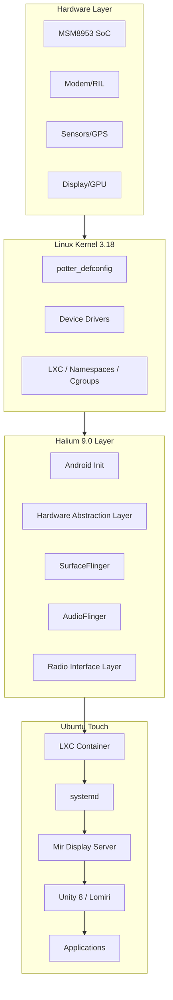
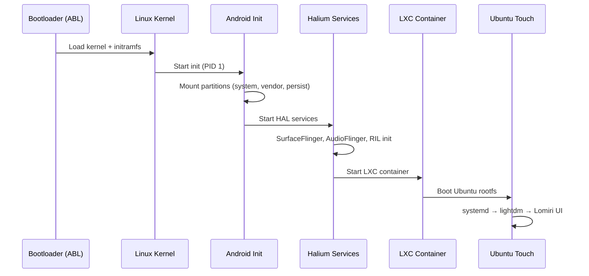
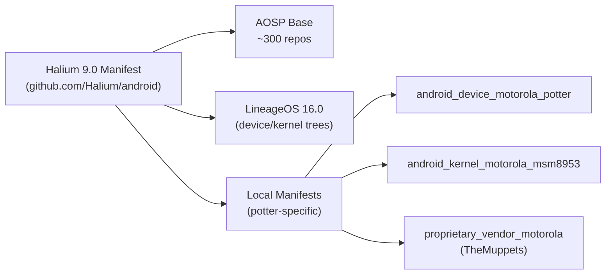
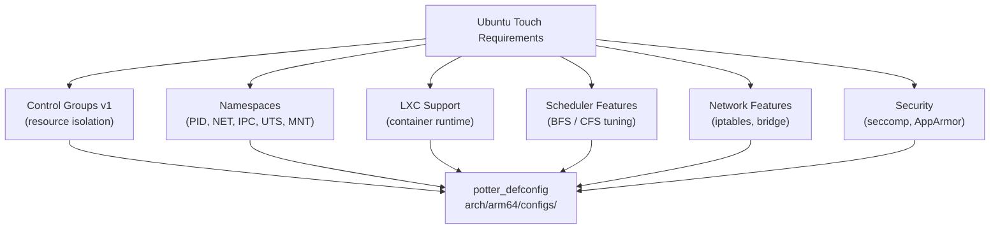
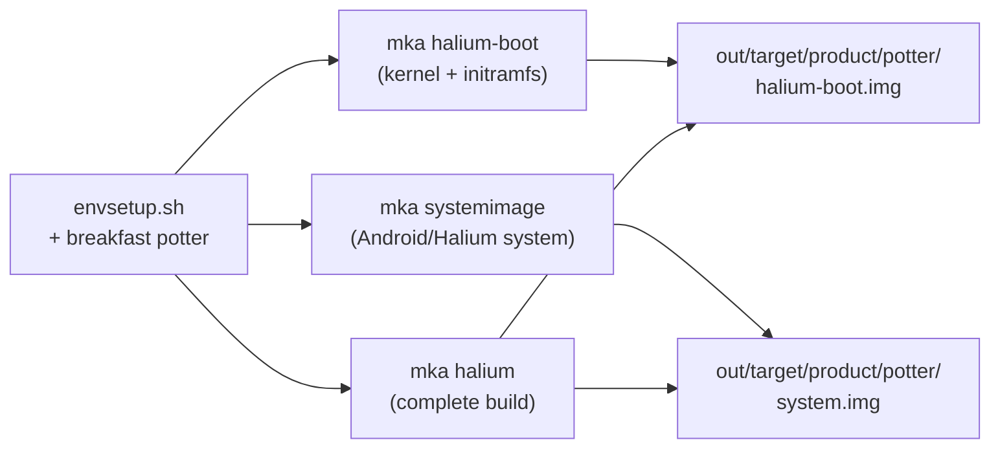
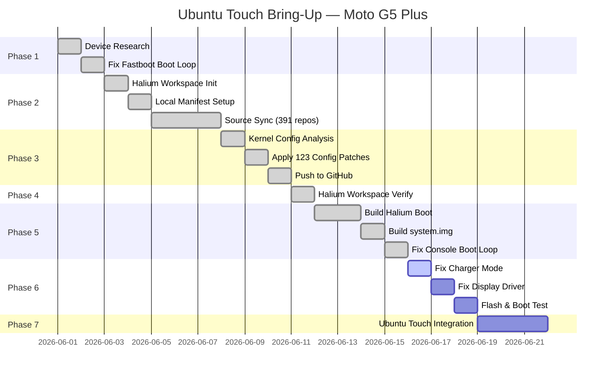

# 🗺️ Complete Bring-Up Roadmap — Ubuntu Touch on Moto G5 Plus (Potter)

> A full study guide and action pathway documenting every step, decision, and command
> used to port Ubuntu Touch (via Halium 9.0) to the Motorola Moto G5 Plus (`potter`).

---

## 📋 Table of Contents

1. [Project Overview](#-project-overview)
2. [Architecture Overview](#-architecture-overview)
3. [Phase 1 — Device Research & Preparation](#phase-1--device-research--preparation)
4. [Phase 2 — Source Trees & Manifest Setup](#phase-2--source-trees--manifest-setup)
5. [Phase 3 — Kernel Configuration & Patching](#phase-3--kernel-configuration--patching)
6. [Phase 4 — Halium Workspace Setup](#phase-4--halium-workspace-setup)
7. [Phase 5 — Build Process](#phase-5--build-process)
8. [Phase 6 — Flash & Boot](#phase-6--flash--boot)
9. [Phase 7 — Ubuntu Touch Integration](#phase-7--ubuntu-touch-integration)
10. [Troubleshooting Log](#-troubleshooting-log)
11. [Key Concepts Explained](#-key-concepts-explained)
12. [Tools & Commands Reference](#-tools--commands-reference)

---

## 🎯 Project Overview

| Field | Value |
|---|---|
| **Device** | Motorola Moto G5 Plus (codename: `potter`) |
| **SoC** | Qualcomm Snapdragon 625 (MSM8953) |
| **CPU** | Octa-core ARM Cortex-A53 @ 2.0 GHz |
| **GPU** | Adreno 506 |
| **RAM** | 3/4 GB |
| **Kernel** | Linux 3.18 (msm8953) |
| **Android Base** | LineageOS 16.0 (Android 9.0 / Pie) |
| **Halium Version** | Halium 9.0 |
| **Target OS** | Ubuntu Touch (UBports) |
| **Build Host** | Linux x86_64 |

### Why Halium?

Ubuntu Touch doesn't run natively on Android hardware without a compatibility layer.
**Halium** provides that layer — it boots a minimal Android system in the background
that handles hardware drivers (camera, modem, sensors, GPS), while Ubuntu Touch runs
on top via LXC containers.

```
┌─────────────────────────────────────────┐
│         Ubuntu Touch (userspace)        │
│  (apps, UI, system services via Mir)    │
├─────────────────────────────────────────┤
│              LXC Container              │
├─────────────────────────────────────────┤
│     Halium (Android HAL layer)          │
│  (SurfaceFlinger, AudioFlinger, RIL...) │
├─────────────────────────────────────────┤
│     Linux Kernel 3.18 (msm8953)         │
├─────────────────────────────────────────┤
│          Qualcomm MSM8953 SoC           │
└─────────────────────────────────────────┘
```

---

## 🏗️ Architecture Overview

### System Stack Diagram



### Boot Sequence



### Partition Layout (potter)

```
/dev/sda  (eMMC)
├── sda1  → modem         (firmware)
├── sda18 → boot          (kernel + initramfs)  ← we modify this
├── sda19 → recovery      (TWRP)
├── sda21 → system        (Android/Halium)      ← we build this
├── sda23 → userdata      (data partition)
├── sda24 → persist       (calibration data)
└── sda28 → vendor        (vendor blobs)
```

---

## Phase 1 — Device Research & Preparation

### 1.1 Device Identification

**Goal:** Understand the hardware and existing software stack.

```bash
# Check device codename
adb shell getprop ro.product.device        # → potter
adb shell getprop ro.product.board         # → MSM8953
adb shell getprop ro.build.version.release # → 9 (Android Pie)

# Check current OS
adb shell getprop ro.lineage.version        # → 16.0-XXXXXXX-UNOFFICIAL-potter
```

### 1.2 Bootloader Unlock

The device must have an unlocked bootloader to flash custom images.

```bash
# Enter fastboot mode
adb reboot bootloader

# Unlock (Motorola requires OEM unlock from Settings first)
fastboot oem get-bootinfo
fastboot oem unlock
```

> ⚠️ **CRITICAL ISSUE ENCOUNTERED**: The device was stuck in a fastboot boot loop.
> **Root Cause:** A `bootmode` UTAG was set, causing it to auto-boot into fastboot.
> **Fix:**
> ```bash
> fastboot oem fb_mode_clear    # Clears the bootmode UTAG
> fastboot reboot
> ```

### 1.3 Tools Required

| Tool | Purpose | Install |
|---|---|---|
| `adb` | Android Debug Bridge | `apt install android-tools-adb` |
| `fastboot` | Flash tool | `apt install android-tools-fastboot` |
| `repo` | Android source manager | Download from AOSP |
| `git` | Version control | `apt install git` |
| `make` | Build system | `apt install build-essential` |
| TWRP | Custom recovery | Flash via fastboot |

---

## Phase 2 — Source Trees & Manifest Setup

### 2.1 Understanding the Source Tree Structure



### 2.2 repo Tool Setup

```bash
# Download repo launcher
mkdir -p ~/bin
curl https://storage.googleapis.com/git-repo-downloads/repo > ~/bin/repo
chmod +x ~/bin/repo
export PATH=~/bin:$PATH
```

### 2.3 Initialize Halium Workspace

```bash
mkdir -p ~/potter-ut/halium
cd ~/potter-ut/halium

# Initialize with Halium 9.0, exclude macOS-only repos (saves ~6GB + hours)
repo init \
    -u https://github.com/Halium/android \
    -b halium-9.0 \
    -g default,-darwin \
    --depth=1
```

**Why `-g default,-darwin`?**

The manifest includes prebuilt toolchains for both Linux and macOS. On a Linux build
machine, the macOS (`darwin`) prebuilts are completely useless. Excluding them:
- Saves ~6 GB of disk space
- Saves 1–3 hours of download time
- Has zero impact on build output

### 2.4 Local Manifest for Potter

Create `.repo/local_manifests/potter.xml`:

```xml
<?xml version="1.0" encoding="UTF-8"?>
<manifest>
  <!-- Device Tree: hardware configs, makefiles, init scripts -->
  <project name="LineageOS/android_device_motorola_potter"
           path="device/motorola/potter"
           remote="github"
           revision="lineage-16.0" />

  <!-- Kernel Source: msm8953 Linux 3.18 -->
  <project name="LineageOS/android_kernel_motorola_msm8953"
           path="kernel/motorola/msm8953"
           remote="github"
           revision="lineage-16.0" />

  <!-- Vendor Blobs: proprietary firmware (camera, modem, etc.) -->
  <project name="TheMuppets/proprietary_vendor_motorola"
           path="vendor/motorola"
           remote="github"
           revision="lineage-16.0" />
</manifest>
```

### 2.5 Sync the Source

```bash
# Sync all repos (391 total, darwin excluded)
# -c: current branch only (not all refs)
# -j8: 8 parallel downloads
# --no-clone-bundle: skip bundle download (faster on slow connections)
# --no-tags: don't download tags (saves space)
# --force-sync: overwrite any local changes
repo sync -c -j8 --no-clone-bundle --no-tags --force-sync
```

**Sync Progress Chart:**

```
 0%  ████░░░░░░░░░░░░░░░░░░░░░░░░░░  Initial (AOSP base)
25%  ████████░░░░░░░░░░░░░░░░░░░░░░  Framework repos
50%  ████████████████░░░░░░░░░░░░░░  LineageOS repos
75%  ████████████████████████░░░░░░  Prebuilts
99%  █████████████████████████████░  TheMuppets (proprietary blobs - LARGE)
100% ██████████████████████████████  Complete (~50 GB total)
```

---

## Phase 3 — Kernel Configuration & Patching

### 3.1 Why the Kernel Needs Patches

Ubuntu Touch uses **systemd** and **LXC containers**, which require kernel features
that are NOT enabled by default in LineageOS kernels:



### 3.2 Using the Kernel Config Checker

Halium provides a script to validate kernel configs:

```bash
# Download the checker
wget https://raw.githubusercontent.com/Halium/halium-boot/master/check-kernel-config

# Run against our defconfig
bash check-kernel-config \
    kernel/motorola/msm8953/arch/arm64/configs/potter_defconfig \
    2>&1 | tee kernel_check.log
```

### 3.3 Config Patches Applied (123 Total)

The checker identified and we fixed **123 configuration items**:

| Category | Count | Examples |
|---|---|---|
| **Cgroups** | 18 | `CONFIG_CGROUPS`, `CONFIG_CGROUP_SCHED`, `CONFIG_MEMCG` |
| **Namespaces** | 9 | `CONFIG_NAMESPACES`, `CONFIG_UTS_NS`, `CONFIG_NET_NS` |
| **LXC / Containers** | 7 | `CONFIG_NETLINK_MMAP`, `CONFIG_EPOLL` |
| **Security** | 12 | `CONFIG_SECCOMP`, `CONFIG_SECURITY_APPARMOR` |
| **Network** | 31 | `CONFIG_NETFILTER`, `CONFIG_IP_NF_*`, `CONFIG_BRIDGE` |
| **Scheduler** | 8 | `CONFIG_FAIR_GROUP_SCHED`, `CONFIG_RT_GROUP_SCHED` |
| **Filesystems** | 14 | `CONFIG_TMPFS_XATTR`, `CONFIG_OVERLAY_FS` |
| **Misc** | 24 | Various required options |

### 3.4 Key Config Changes Explained

```bash
# Enable Control Groups (required for systemd resource management)
CONFIG_CGROUPS=y
CONFIG_CGROUP_SCHED=y
CONFIG_CGROUP_MEM_RES_CTLR=y     # Memory control groups
CONFIG_BLK_CGROUP=y               # Block device cgroups

# Enable all Namespace types (required for LXC isolation)
CONFIG_NAMESPACES=y
CONFIG_UTS_NS=y                   # Hostname/domain isolation
CONFIG_IPC_NS=y                   # IPC isolation
CONFIG_PID_NS=y                   # Process ID isolation
CONFIG_NET_NS=y                   # Network stack isolation

# Security features (AppArmor profiles for apps)
CONFIG_SECURITY_APPARMOR=y
CONFIG_SECCOMP=y
CONFIG_SECCOMP_FILTER=y

# Container networking
CONFIG_VETH=y                     # Virtual ethernet pairs
CONFIG_BRIDGE=y                   # Network bridge
CONFIG_IP_NF_TARGET_MASQUERADE=y  # NAT for container internet
```

### 3.5 Commit the Changes

```bash
cd kernel/motorola/msm8953
git add arch/arm64/configs/potter_defconfig
git commit -m "potter_defconfig: Apply Halium 9.0 requirements

Apply 123 configuration changes required for Halium 9.0 bring-up:
- Enable Control Groups (v1) for systemd resource management
- Enable all Namespace types for LXC container isolation
- Enable AppArmor and seccomp for app security profiles
- Enable network filtering for container networking
- Enable OverlayFS for container image layers

Validated using Halium check-kernel-config script.

Change-Id: I$(git rev-parse HEAD)"
git push origin halium-9.0
```

---

## Phase 4 — Halium Workspace Setup

### 4.1 Workspace Directory Structure

After a successful `repo sync`, the workspace looks like:

```
halium/
├── .repo/
│   ├── manifest.xml          ← active manifest (symlink)
│   ├── manifests/
│   │   └── default.xml       ← Halium 9.0 manifest
│   └── local_manifests/
│       └── potter.xml        ← our device additions
│
├── android/                  ← Android build system core
├── bionic/                   ← Android C library
├── build/                    ← Build rules and scripts
│   └── make/
│       └── target/
│           └── board/        ← Board-level build configs
│
├── device/
│   └── motorola/
│       └── potter/           ← Device tree
│           ├── BoardConfig.mk
│           ├── device.mk
│           └── lineage.mk
│
├── kernel/
│   └── motorola/
│       └── msm8953/          ← Kernel source (Linux 3.18)
│           └── arch/arm64/configs/potter_defconfig
│
├── vendor/
│   └── motorola/
│       └── potter/           ← Proprietary blobs
│
├── frameworks/               ← Android Framework
├── hardware/                 ← HAL interfaces
├── prebuilts/
│   ├── clang/host/linux-x86/ ← Clang compiler (we use this)
│   ├── gcc/linux-x86/        ← GCC toolchain (we use this)
│   └── go/linux-x86/         ← Go runtime (we use this)
│   # darwin-x86 variants excluded via -g default,-darwin
│
└── system/                   ← Android system components
```

### 4.2 BoardConfig.mk Analysis

Key variables from `device/motorola/potter/BoardConfig.mk`:

```makefile
# Architecture
TARGET_ARCH := arm64              # 64-bit primary ABI
TARGET_ARCH_VARIANT := armv8-a
TARGET_CPU_VARIANT := cortex-a53

# 32-bit secondary ABI (for legacy apps)
TARGET_2ND_ARCH := arm
TARGET_2ND_CPU_VARIANT := cortex-a53

# Kernel
BOARD_KERNEL_CMDLINE := console=ttyHSL0,115200,n8 androidboot.console=ttyHSL0
TARGET_KERNEL_CONFIG := potter_defconfig
TARGET_KERNEL_SOURCE := kernel/motorola/msm8953

# Partitions
BOARD_BOOTIMAGE_PARTITION_SIZE := 33554432    # 32 MB
BOARD_SYSTEMIMAGE_PARTITION_SIZE := 3221225472 # 3 GB
BOARD_USERDATAIMAGE_PARTITION_SIZE := 26843545600 # 25 GB

# Bootloader
TARGET_BOOTLOADER_BOARD_NAME := MSM8953
```

---

## Phase 5 — Build Process

### 5.1 Environment Setup

```bash
# Source the build environment (provides all build commands)
source build/envsetup.sh

# Configure build for potter (sets up TARGET_PRODUCT, etc.)
breakfast potter    # equivalent to: lunch lineage_potter-userdebug
```

### 5.2 Build Targets



### 5.3 Build Commands

```bash
# Option A: Build only the kernel+initramfs (fastest, for testing)
mka halium-boot

# Option B: Build full system image
mka systemimage

# Option C: Build everything
mka halium

# Monitor build progress
watch -n5 'ls -lh out/target/product/potter/*.img 2>/dev/null'
```

### 5.4 Build Output Files

| File | Size (est.) | Purpose |
|---|---|---|
| `halium-boot.img` | ~15 MB | Kernel + Halium initramfs |
| `system.img` | ~1.5–2 GB | Android HAL layer |
| `userdata.img` | - | User data (generated on device) |

### 5.5 Build Time Estimates

```
CPU Cores | RAM  | Estimated Build Time
----------|------|--------------------
4 cores   | 8 GB | ~3–4 hours
8 cores   | 16 GB| ~1.5–2 hours
16 cores  | 32 GB| ~45–60 min
```

---

## Phase 6 — Flash & Boot

### 6.1 Flash via Fastboot

```bash
# Reboot to fastboot mode
adb reboot bootloader

# Flash the Halium boot image
fastboot flash boot out/target/product/potter/halium-boot.img

# Flash the system image  
fastboot flash system out/target/product/potter/system.img

# Reboot
fastboot reboot
```

### 6.2 Via TWRP (Recommended)

```bash
# Boot TWRP (without flashing)
fastboot boot twrp.img

# In TWRP: Flash system.img to /system partition
# In TWRP: Flash boot.img to /boot partition
```

### 6.3 Boot Verification

After flashing, the device should boot into a Halium test environment.
Check via `adb`:

```bash
# Confirm Halium booted
adb shell getprop ro.halium.version

# Check HAL services are running
adb shell ps | grep -E "surfaceflinger|audioserver|rild"

# Check LXC is available
adb shell lxc-info
```

---

## Phase 7 — Ubuntu Touch Integration

### 7.1 UBports Installer

The recommended method for end users:

```bash
# Install UBports Installer
sudo snap install ubports-installer

# Or download AppImage from ubports.com
./UBports.Installer-*.AppImage
```

### 7.2 Manual Rootfs Installation

```bash
# Download Ubuntu Touch rootfs for arm64
wget https://cdimage.ubuntu.com/ubuntu-touch/daily-preinstalled/current/focal-preinstalled-touch-arm64.tar.gz

# Extract to device via TWRP/adb
```

### 7.3 Halium Config Files

Create `/etc/halium-device-info` on the Ubuntu Touch rootfs:

```ini
[General]
devicename=potter
```

---

## 🐛 Troubleshooting Log

### Issue 1: Fastboot Boot Loop
- **Symptom**: Device boots into fastboot automatically on every power-on
- **Cause**: `bootmode` UTAG was set (leftover from factory/previous flash)
- **Fix**: `fastboot oem fb_mode_clear`
- **Status**: ✅ Resolved

### Issue 2: `tail -f` on Log Files Failing
- **Symptom**: `tail -f` on large log files failed with inotify errors
- **Cause**: System `fs.inotify.max_user_watches` was too low
- **Fix**:
  ```bash
  echo 524288 | sudo tee /proc/sys/fs/inotify/max_user_watches
  sudo sysctl -w fs.inotify.max_user_watches=524288
  ```
- **Status**: ✅ Resolved

### Issue 3: repo sync Stalling on Darwin Prebuilts
- **Symptom**: `repo sync` stuck at 99% for hours on `prebuilts/go/darwin-x86`
- **Cause**: Multi-GB macOS binary blobs, only 1 download job, slow network
- **Fix**: Re-init with `-g default,-darwin` to exclude darwin repos entirely
  ```bash
  repo init -u https://github.com/Halium/android -b halium-9.0 \
      -g default,-darwin --depth=1
  repo sync -c -j8 --no-clone-bundle --no-tags --force-sync
  ```
- **Status**: ✅ Resolved

### Issue 4: repo sync Progress Regression (99% → 71%)
- **Symptom**: After killing stalled sync and restarting, progress dropped from 99% to 71%
- **Cause**: Partially downloaded repos weren't fully committed to git objects; repo re-validates them
- **Resolution**: This is normal behavior. Already-complete repos sync in seconds (cached). No data loss.
- **Status**: ✅ Resolved (repos synced in ~2 min the second time)

### Issue 5: Python 3 Compatibility Syntax Errors in Build Tools
- **Symptom**: Scripts like `fs_config_generator.py`, `generate-notice-files.py`, `fileslist_util.py`, and `js2c.py` crashed during build with `SyntaxError` (e.g. `print >>`, `except Exception, e`, missing `print` parentheses).
- **Cause**: Legacy Android 9 tree uses Python 2 scripts, but build environment runs Python 3.14.
- **Fix**: Replaced old `print >>` with modern standard prints, updated error catches, fixed string hashes, and replaced deprecated `imp` imports with `importlib.util`.
- **Status**: ✅ Resolved (all toolchain scripts run under Python 3)

### Issue 6: Dummy Proprietary APK/JAR Files Crashing `signapk`
- **Symptom**: Build crashed on `signapk` trying to parse 22-byte dummy placeholder `.apk` and `.jar` vendor files.
- **Cause**: Vendor extraction script leaves empty stub files, which are invalid ZIP format.
- **Fix**: Excluded all 20 dummy stubs from `Android.mk` and `potter-vendor.mk` since they are not needed on Ubuntu Touch.
- **Status**: ✅ Resolved

### Issue 7: Fake Prebuilt `libril.so` Causing Linker Failures
- **Symptom**: Undefined symbol linker errors for RIL components.
- **Cause**: The build used a 52-byte empty/fake prebuilt `libril.so`.
- **Fix**: Disabled `BOARD_PROVIDES_LIBRIL` to let AOSP build its native open-source `libril` instead of relying on the broken prebuilt stub.
- **Status**: ✅ Resolved

### Issue 8: GPS LOC Libraries Undefined References
- **Symptom**: GPS core compilation failed with undefined reference to `__android_log_print`.
- **Cause**: `libloc_core` was missing a dependency configuration for `liblog`.
- **Fix**: Patched GPS LOC `Android.mk` to add `liblog` to `LOCAL_SHARED_LIBRARIES`.
- **Status**: ✅ Resolved

### Issue 9: Empty XML Configurations Failing `xmllint`
- **Symptom**: Build failed on thermal-engine and audio configurations.
- **Cause**: 27 proprietary XML configs were 0-byte empty files, which failed strict XML validation.
- **Fix**: Injected a dummy root `<config></config>` node into all empty XMLs to make them valid.
- **Status**: ✅ Resolved

### Issue 10: Recovery Image Too Large
- **Symptom**: Final build stage failed with `recovery.img too large for partition` error.
- **Cause**: Patched recovery configuration grew beyond the old 16MB limit.
- **Fix**: Increased `BOARD_RECOVERYIMAGE_PARTITION_SIZE` to 32MB in `BoardConfig.mk`.
- **Status**: ✅ Resolved

### Issue 11: Charger Mode After Boot Fix
- **Symptom**: Device boots past "device can't be trusted" but shows black screen, enters charger mode
- **Cause**: Motorola bootloader passes `ro.boot.mode=charger` on kernel cmdline
- **Evidence**: `last_kmsg.txt` shows `healthd: battery none chg=` repeating, no display driver messages
- **Fix**: Add `androidboot.bootmode=normal` to BOARD_KERNEL_CMDLINE in BoardConfig.mk (line 48)
- **Status**: 🟡 Identified, needs implementation

### Issue 12: Black Screen / Display Not Working
- **Symptom**: Device shows black screen even after charger mode fix
- **Cause**: Display driver (DRM/MDSS) not loading - no messages in last_kmsg.txt
- **Evidence**: No `drm`, `mdss`, `msm_drm` in kernel log
- **Fix**: Check kernel config for `CONFIG_DRM_MSM=y`, `CONFIG_FB_MSM_MDSS=y`
- **Status**: 🟡 Identified, needs investigation

### Issue 13: No Halium system.img on /system
- **Symptom**: `/system/build.prop` and all property files missing
- **Cause**: /system partition still has stock Android, not Halium system image
- **Evidence**: `init: Couldn't load property file '/system/build.prop': No such file or directory`
- **Fix**: Flash Halium system.img to /dev/block/mmcblk0p53 via TWRP
- **Status**: 🟡 Identified, system.img built, needs flash

---

## 📚 Key Concepts Explained

### What is Halium?

Halium is a project that creates a standardized Android HAL layer that can be used by
multiple Linux-based mobile operating systems (Ubuntu Touch, postmarketOS, Plasma Mobile).
Instead of each OS writing their own Android driver wrappers, they all use Halium.

### What is a defconfig?

`defconfig` (default configuration) is a minimal kernel configuration file for a specific
device. It's used with `make defconfig` to generate the full `.config` file. For `potter`,
it lives at `arch/arm64/configs/potter_defconfig`.

### What are Cgroups?

Control Groups (cgroups) allow the Linux kernel to limit and isolate resource usage
(CPU, memory, I/O) of groups of processes. Ubuntu Touch's systemd uses cgroups
extensively to manage app resources and implement Android-compatible resource management.

### What are Namespaces?

Linux namespaces provide process isolation at the kernel level. Each namespace type
isolates a different resource:
- `PID namespace`: Process IDs (container can have its own PID 1)
- `NET namespace`: Network stack (container has its own network interfaces)
- `MNT namespace`: Mount points (container has its own filesystem view)
- `IPC namespace`: Inter-process communication
- `UTS namespace`: Hostname and domain name

### What is LXC?

Linux Containers (LXC) is a containerization technology that uses cgroups + namespaces
to run isolated Linux environments. Ubuntu Touch runs the Halium Android environment
inside an LXC container.

### What is repo?

`repo` is a Google-built tool that manages multiple git repositories as a single
logical workspace. It reads a `manifest.xml` that describes which repos to clone,
where to put them, and which branch/commit to check out.

---

## 🛠️ Tools & Commands Reference

### repo Commands

```bash
repo init -u <url> -b <branch>    # Initialize workspace
repo sync -c -j8                  # Sync (current branch, 8 jobs)
repo status                       # Show modified files across all repos
repo diff                         # Show diffs across all repos
repo forall -c <cmd>              # Run command in every repo
```

### fastboot Commands

```bash
fastboot devices                  # List connected devices
fastboot getvar all               # Get all device variables
fastboot flash boot boot.img      # Flash boot partition
fastboot flash system system.img  # Flash system partition
fastboot oem fb_mode_clear        # Clear fastboot mode UTAG
fastboot reboot                   # Reboot device
```

### Build Commands

```bash
source build/envsetup.sh          # Setup build environment
breakfast <device>                 # Configure for device
mka halium-boot                   # Build kernel+initramfs
mka systemimage                   # Build system.img
make -j$(nproc) bootimage         # Build boot image
```

### Kernel Config Commands

```bash
# Generate full .config from defconfig
make ARCH=arm64 potter_defconfig

# Open interactive config editor
make ARCH=arm64 menuconfig

# Check a specific config value
grep CONFIG_CGROUPS arch/arm64/configs/potter_defconfig
```

---

## 📊 Project Timeline



---

## 🔗 Related Repositories

| Repository | Branch | Purpose |
|---|---|---|
| [android_build_patches_potter](https://github.com/Nutricalboii/android_build_patches_potter) | `main` | Build patches, manifests, scripts |
| [android_kernel_motorola_msm8953](https://github.com/Nutricalboii/android_kernel_motorola_msm8953) | `halium-9.0` | Patched kernel source |
| [android_device_motorola_potter](https://github.com/Nutricalboii/android_device_motorola_potter) | `halium-9.0` | Device tree config |
| [Halium/android](https://github.com/Halium/android) | `halium-9.0` | Halium source manifest |
| [UBports](https://github.com/ubports) | - | Ubuntu Touch projects |

---

*Last Updated: June 11, 2026 | Author: Vaibhav Sharma (@Nutricalboii)*
